# Muapi-GTM ⚡
### Production-Grade Self-Hosted GTM Data Engine & Clay Alternative

> Powered natively by **Muapi APIs** — replacing 10+ fragmented vendor subscriptions (Apollo, Hunter, Prospeo, Snov, Dropcontact, BuiltWith, Exa, OpenAI) with a **single unified API key**.

---

## 🚀 Overview

**Muapi-GTM** is a self-hosted B2B Go-To-Market (GTM) data orchestration platform modeled after modern visual data engines like **Clay**, engineered from the ground up for high-throughput account qualification, decision-maker discovery, buying signal tracking, and multimodal outreach.

Built with **FastAPI** + **SQLite WAL** on the backend and **React** + **TanStack Virtualized Grid** on the frontend, Muapi-GTM delivers sub-millisecond cell rendering for 1,000+ rows while cascading live lookups across official Muapi capabilities.

```mermaid
flowchart TD
    subgraph UI ["Modern Minimal UI (React 19 + Inter Font)"]
        Grid["Clay-Style Virtualized Grid (:5174)"]
        SignalsUI["Buying Signals Timeline"]
        OutreachUI["Multimodal Outreach Studio"]
        AutoUI["Automation Rule Runner"]
    end

    subgraph Core ["Muapi-GTM Core (:3960)"]
        Router["FastAPI Routers"]
        Formula["Formula & Macro Evaluator"]
        Queue["Async Waterfall Engine"]
        DB[(SQLite WAL High-Concurrency)]
    end

    subgraph Muapi ["Unified Muapi GTM API Engine"]
        F1["/company-enrich\n(Firmographics)"]
        F2["/people-search\n(Contacts & Profile)"]
        F3["/email-verify\n(Deliverability)"]
        F4["/company-technographics\n(Tech Stack)"]
        F5["/company-buying-signals\n(Intent Surge)"]
        F6["/people-rank-decision-makers\n(Ranked Buyers)"]
        F7["/company-funding\n(Rounds & Capital)"]
        F8["/company-job-postings\n(Hiring Expansion)"]
        F9["/company-headcount-growth\n(Growth Velocity)"]
        F10["/research-web-answer\n(Exa Cited Answers)"]
        F11["/v1/chat/completions\n(LLM Transforms)"]
        F12["Muapi Multimodal\n(TTS Voice Notes + Brand Mockups)"]
    end

    Grid --> Router
    SignalsUI --> Router
    OutreachUI --> Router
    AutoUI --> Router

    Router --> Formula
    Router --> Queue
    Queue --> DB

    Queue --> F1
    Queue --> F2
    Queue --> F3
    Queue --> F4
    Queue --> F5
    Queue --> F6
    Queue --> F7
    Queue --> F8
    Queue --> F9
    Queue --> F10
    Queue --> F11
    Queue --> F12
```



---

## 🎯 Traditional Provider ➔ Muapi Live Endpoint Mapping

In traditional GTM stacks, users must sign up for over 10 separate services with individual rate limits and credit balances. **Muapi-GTM unifies the entire stack behind one key**:

| Traditional Provider Category | Purpose | Muapi Live Endpoint | Status in Muapi |
|---|---|---|---|
| Apollo.io, People Data Labs | Company firmographics & profiles | `POST /api/v1/company-enrich` | **Live** |
| Apollo.io, Contact Finders | Professional contact discovery | `POST /api/v1/people-search` | **Live** |
| Hunter.io, Prospeo, DeBounce | Work email verification & bounce risk | `POST /api/v1/email-verify` | **Live** |
| BuiltWith, Wappalyzer | Website technographics & tech detection | `POST /api/v1/company-technographics` | **Live** |
| Bombora, 6sense Intent Feeds | Intent & buying signals timeline | `POST /api/v1/company-buying-signals` | **Live** |
| LeadIQ, Decision Maker Engines | Rank & discover key buyer contacts | `POST /api/v1/people-rank-decision-makers` | **Live** |
| Crunchbase, PitchBook | Funding rounds, investors, capital raised | `POST /api/v1/company-funding` | **Live** |
| Greenhouse, Lever ATS Scrapers | Active job postings by department | `POST /api/v1/company-job-postings` | **Live** |
| LinkedIn Talent Insights | Headcount growth velocity & trends | `POST /api/v1/company-headcount-growth` | **Live** |
| LinkedIn Employee Scrapers | Company LinkedIn roster extraction | `POST /api/v1/linkedin-employees` | **Live** |
| LinkedIn Company Intel | Public LinkedIn company profile data | `POST /api/v1/linkedin-company-profile` | **Live** |
| LinkedIn Search Adapters | Search LinkedIn members by title/company | `POST /api/v1/linkedin-people-search` | **Live** |
| Exa, Web Search Engines | Cited account web research | `POST /api/v1/research-web-answer` | **Live** |
| OpenAI GPT-4o, Claygent | LLM transformations & ICP scoring | `POST /v1/chat/completions` | **Live** |
| *(Muapi Exclusive)* | Personalized 15s voice audio notes | Muapi TTS (`elevenlabs-tts-turbo-2-5`) | **Live** |
| *(Muapi Exclusive)* | Dynamic prospect visual asset mockups | Muapi Image (`flux-schnell` / `sdxl`) | **Live** |

---

## ✨ Key Features

1. **Clay-Style Virtualized Spreadsheet Grid**:
   - High-performance scrolling for 1,000+ rows using `@tanstack/react-virtual`.
   - In-line double-click editing, drag/reorder, status pills, and column menus.
   - Provenance drawer displaying exact JSON responses, latency (ms), and cited web URLs.
   - Built-in CSV import with automatic column header detection and one-click CSV export.

2. **Custom Minimalist UI with Inter Typography**:
   - Executive dark design system with clean 1px borders, smooth micro-interactions, and zero clutter.
   - **100% Custom Dropdowns**: Dedicated `CustomSelect` component replaces all native `<select>` tags for a cohesive feel.

3. **Smart Multi-Stage Waterfall Engine**:
   - Cascades lookups: Free keyless checks ➔ Unified Muapi routed pipeline ➔ Optional BYOK fallback (Apollo, Hunter).
   - Halts at first verified match to minimize credit consumption.

4. **Web Research Agent (Powered by `/research-web-answer`)**:
   - Research columns ask open-ended questions per row (e.g. *"What is {Company}'s pricing tier and target customer?"*).
   - Generates cited answers with clickable source badges and reasoning traces.

5. **Multimodal Outreach Studio**:
   - Generates high-converting 1-to-1 cold emails and LinkedIn notes under 90 words.
   - Synthesizes personalized 15-second audio voice notes (*"Hey Sarah, noticed you're scaling RevOps at Stripe..."*) playable directly in the browser.
   - Generates branded visual previews containing prospect company branding.

6. **Event-Driven Automations**:
   - Trigger ➔ Filter ➔ Action workflow rules.
   - *Example*: When a hiring surge is detected on a target domain ➔ Automatically rank VP decision-makers ➔ Generate personalized intro copy.

7. **Native Model Context Protocol (MCP) Server**:
   - Built-in stdio MCP server (`backend/mcp/server.py`) allowing AI agents in **Cursor**, **Claude Code**, and **Windsurf** to inspect workbooks and execute enrichments natively.

8. **Zero-Config Portability & Sandbox Mode**:
   - Zero external services required to start: SQLite with WAL mode creates local databases automatically.
   - If no API key is entered, an intelligent deterministic sandbox mode provides realistic B2B test data so workflows never stall.

---

## 📦 Project Structure

```
muapi-gtm/
├── frontend/                       # React 18 + Vite + Inter Font Minimal UI (:5174)
│   ├── src/
│   │   ├── api/client.js           # REST API client with full typed methods
│   │   ├── components/
│   │   │   ├── CustomSelect.jsx    # Custom dropdown replacing all <select> tags
│   │   │   └── Sidebar.jsx         # Minimal dark navigation & live status pill
│   │   ├── pages/
│   │   │   ├── WorkbooksPage.jsx   # List of sheets & preset templates
│   │   │   ├── EditorPage.jsx      # Clay-style virtualized grid & provenance drawer
│   │   │   ├── LeadsPage.jsx       # Global prospect & company database
│   │   │   ├── SignalsPage.jsx     # Intent & buying signals timeline ("Watches")
│   │   │   ├── CampaignsPage.jsx   # Multimodal Outreach Studio (Text, Voice, Mockup)
│   │   │   ├── AutomationsPage.jsx # Trigger ➔ Action automated rules
│   │   │   └── SettingsPage.jsx    # Unified Muapi key, latency test & capability matrix
│   │   ├── App.jsx                 # Route manager
│   │   ├── index.css               # Clean minimal dark styling tokens
│   │   └── main.jsx
│   ├── package.json
│   └── vite.config.js              # Proxy /api to :3960
├── backend/                        # FastAPI + SQLite WAL Service (:3960)
│   ├── core/
│   │   ├── config.py               # Port, Host, and Directory settings
│   │   └── db.py                   # Async SQLAlchemy engine with SQLite WAL
│   ├── services/
│   │   ├── muapi/
│   │   │   └── client.py           # Unified client for all 14 Muapi endpoints
│   │   └── workbook/
│   │       ├── models.py           # Workbook, Row, View, Lead, Signal, Automation
│   │       ├── formula_evaluator.py# Spreadsheet formula macro parser
│   │       └── executor.py         # Batch row execution engine
│   ├── routers/
│   │   ├── workbooks.py            # Sheets, virtualized rows, CSV import/export
│   │   ├── leads.py                # Global lead repository
│   │   ├── signals.py              # Buying signal scanning & timeline
│   │   ├── automations.py          # Trigger-action rules
│   │   ├── outreach.py             # Multimodal copy, voice & mockup generation
│   │   └── settings.py             # Masked API keys & live health check
│   ├── mcp/
│   │   └── server.py               # Stdio MCP Server for Cursor & Claude Code
│   ├── main.py                     # FastAPI entry point
│   └── requirements.txt
└── package.json                    # Root runner (npm run dev)
```

---

## ⚡ Quick Start

### 1. Prerequisites
- Python 3.10+
- Node.js 18+

### 2. Setup
Install all dependencies with one command:
```bash
# From muapi-gtm root directory
npm run install:all
```

### 3. Run Locally
```bash
npm run dev
```

This concurrently boots:
- **Backend API**: `http://127.0.0.1:3960`
- **Frontend App**: `http://localhost:5174`

### 4. Configure Your Key
Open `http://localhost:5174`, navigate to **API & Settings**, enter your **Muapi API Key**, and click **Test Connection**.

---

## 🤖 MCP Server Integration (Cursor / Claude Code)

Add this entry to your `claude_desktop_config.json` or Cursor MCP settings:

```json
{
  "mcpServers": {
    "muapi-gtm": {
      "command": "python",
      "args": ["c:/Users/JAYAP/joint-folder/muapi-gtm/backend/mcp/server.py"]
    }
  }
}
```

Now you can prompt your AI agent:
> *"Inspect the enterprise prospects in my active workbook and run company enrichment and tech stack detection on all rows with intent scores above 80."*

---

## 📄 License
MIT License. Built for high-velocity GTM teams.
